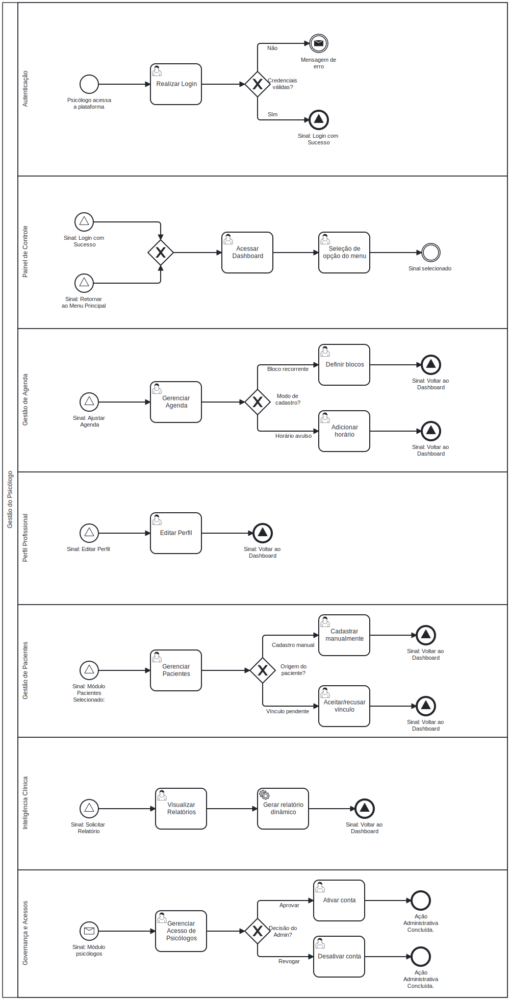

### 3.3.1 Processo 1 – Gestão do Psicólogo

Este processo centraliza todas as ações administrativas e de configuração realizadas pelo psicólogo na plataforma PsiHub. O fluxo inicia com a autenticação do profissional e dá acesso a um painel central (dashboard), a partir do qual é possível editar o perfil profissional, configurar a disponibilidade na agenda, gerenciar pacientes e visualizar relatórios de evolução clínica. O psicólogo que também atua como **administrador da clínica** possui, adicionalmente, a capacidade de aprovar ou revogar o acesso de outros psicólogos à plataforma — porém, em cumprimento ao **Art. 9º do Código de Ética Profissional do Psicólogo** e à **LGPD**, o administrador **não tem acesso a dados clínicos, prontuários ou registros emocionais** de pacientes vinculados a outros profissionais.

A principal oportunidade de melhoria em relação ao modelo atual é a centralização de todas essas atividades em um único ambiente digital seguro, eliminando o uso de ferramentas genéricas e registros dispersos.

---

#### Detalhamento das atividades

---

**Atividade 1 – Realizar Login**

| **Campo** | **Tipo** | **Restrições** | **Valor default** |
| --- | --- | --- | --- |
| E-mail | Caixa de Texto | Formato de e-mail válido; obrigatório | — |
| Senha | Caixa de Texto | Mínimo de 8 caracteres; obrigatório | — |

| **Comandos** | **Destino** | **Tipo** |
| --- | --- | --- |
| Entrar | Verificação de credenciais → Dashboard (se válido) ou mensagem de erro (se inválido) | default |
| Esqueci minha senha | Fluxo de recuperação de senha via e-mail | — |
| Cadastrar-se | Início do fluxo de cadastro do psicólogo (aguarda aprovação do administrador) | — |

> **Regra de negócio:** Caso as credenciais sejam inválidas ou a conta ainda não tenha sido aprovada pelo administrador, o sistema exibe uma mensagem de erro descritiva e o psicólogo pode tentar novamente no mesmo fluxo.

---

**Atividade 2 – Acessar Dashboard**

| **Campo** | **Tipo** | **Restrições** | **Valor default** |
| --- | --- | --- | --- |
| Próximas consultas do dia | Tabela | Somente leitura; exibe data, hora e nome do paciente | — |
| Notificações pendentes | Tabela | Somente leitura; ex.: novos vínculos de pacientes aguardando aceite | — |
| Atalhos de navegação | Link | Acesso rápido às funcionalidades principais | — |

| **Comandos** | **Destino** | **Tipo** |
| --- | --- | --- |
| Editar Perfil | Atividade 3 – Cadastrar/Editar Perfil Profissional | — |
| Gerenciar Agenda | Atividade 4 – Gerenciar Agenda | — |
| Gerenciar Pacientes | Atividade 5 – Cadastrar/Gerenciar Pacientes | — |
| Visualizar Relatórios | Atividade 6 – Visualizar Relatórios e Evolução | — |
| Gerenciar Psicólogos *(somente Admin)* | Atividade 7 – Gerenciar Acesso de Psicólogos | — |
| Sair (logout) | Fim do Processo 1 | cancel |

---

**Atividade 3 – Cadastrar/Editar Perfil Profissional**

| **Campo** | **Tipo** | **Restrições** | **Valor default** |
| --- | --- | --- | --- |
| Nome completo | Caixa de Texto | Obrigatório; máximo de 100 caracteres | — |
| CRP | Caixa de Texto | Obrigatório; formato XX/XXXXXX | — |
| Foto de perfil | Imagem | Formatos JPEG ou PNG; tamanho máximo de 5 MB | — |
| Especialidades / abordagens terapêuticas | Seleção múltipla | Pelo menos 1 opção selecionada | — |
| Valor da consulta | Número | Obrigatório; valor positivo em R$ | — |
| Biografia / apresentação profissional | Área de Texto | Máximo de 500 caracteres | — |

| **Comandos** | **Destino** | **Tipo** |
| --- | --- | --- |
| Salvar | Dashboard (perfil atualizado com sucesso) | default |
| Cancelar | Dashboard (sem salvar alterações) | cancel |

---

**Atividade 4 – Gerenciar Agenda**

O psicólogo pode configurar sua disponibilidade por dois modos complementares:

**4a – Definir Blocos Recorrentes**

| **Campo** | **Tipo** | **Restrições** | **Valor default** |
| --- | --- | --- | --- |
| Dias da semana | Seleção múltipla | Pelo menos 1 dia selecionado | — |
| Horário de início | Hora | Obrigatório; formato hh:mm | — |
| Horário de fim | Hora | Obrigatório; deve ser posterior ao início | — |
| Duração da consulta | Número | Em minutos; obrigatório | 50 |
| Intervalo entre consultas | Número | Em minutos; obrigatório | 10 |
| Data de início de vigência | Data | Obrigatório; formato dd-mm-aaaa | — |
| Data de fim de vigência | Data | Opcional; formato dd-mm-aaaa | — |

**4b – Adicionar Horário Manual (avulso)**

| **Campo** | **Tipo** | **Restrições** | **Valor default** |
| --- | --- | --- | --- |
| Data | Data | Obrigatório; não pode ser data passada | — |
| Horário de início | Hora | Obrigatório; formato hh:mm | — |
| Horário de fim | Hora | Obrigatório; deve ser posterior ao início | — |

| **Comandos** | **Destino** | **Tipo** |
| --- | --- | --- |
| Salvar disponibilidade | Dashboard (agenda atualizada) | default |
| Bloquear horário específico | Marca slot como indisponível na agenda | — |
| Cancelar | Dashboard (sem salvar) | cancel |

---

**Atividade 5 – Cadastrar/Gerenciar Pacientes**

Dois fluxos são possíveis:

**5a – Cadastro manual pelo psicólogo**

| **Campo** | **Tipo** | **Restrições** | **Valor default** |
| --- | --- | --- | --- |
| Nome completo | Caixa de Texto | Obrigatório; máximo de 100 caracteres | — |
| Data de nascimento | Data | Obrigatório; formato dd-mm-aaaa | — |
| E-mail | Caixa de Texto | Formato de e-mail válido | — |
| Telefone | Caixa de Texto | Formato (DD) 9XXXX-XXXX | — |
| Observações iniciais | Área de Texto | Opcional; máximo de 300 caracteres | — |

**5b – Aceite de vínculo (paciente auto-cadastrado)**

| **Campo** | **Tipo** | **Restrições** | **Valor default** |
| --- | --- | --- | --- |
| Lista de solicitações pendentes | Tabela | Somente leitura; exibe nome, e-mail e data da solicitação | — |

| **Comandos** | **Destino** | **Tipo** |
| --- | --- | --- |
| Salvar paciente | Dashboard / lista de pacientes | default |
| Aceitar vínculo | Paciente vinculado ao psicólogo | default |
| Recusar vínculo | Solicitação recusada; paciente notificado | cancel |
| Ver perfil do paciente | Tela de perfil e histórico do paciente | — |
| Cancelar | Dashboard | cancel |

---

**Atividade 6 – Visualizar Relatórios e Evolução**

| **Campo** | **Tipo** | **Restrições** | **Valor default** |
| --- | --- | --- | --- |
| Paciente | Seleção única | Lista de pacientes vinculados ao psicólogo logado; obrigatório | — |
| Período (de) | Data | Formato dd-mm-aaaa | — |
| Período (até) | Data | Formato dd-mm-aaaa; deve ser posterior ao início | — |
| Tipo de relatório | Seleção única | Humor/Bem-estar; Consultas; Evolução clínica; Registros emocionais; Financeiro | — |
| Gráfico de humor/bem-estar | Imagem | Somente leitura; gerado dinamicamente pelo sistema | — |
| Histórico de consultas realizadas | Tabela | Somente leitura; data, duração e observações | — |
| Evolução clínica (linha do tempo) | Tabela | Somente leitura; anotações ordenadas cronologicamente | — |
| Frequência de registros emocionais | Número | Somente leitura; total de registros no período | — |
| Resumo financeiro | Tabela | Somente leitura; consultas realizadas × valor × total recebido | — |

| **Comandos** | **Destino** | **Tipo** |
| --- | --- | --- |
| Gerar relatório | Atualiza visualização com os filtros selecionados | default |
| Exportar PDF | Download do relatório filtrado em formato PDF | — |
| Voltar | Dashboard | cancel |

> **Restrição de acesso (LGPD + Art. 9º do Código de Ética):** Os dados exibidos nesta tela são estritamente restritos ao psicólogo autenticado. Nenhum outro perfil — incluindo o administrador — possui acesso a prontuários, registros emocionais ou anotações clínicas de pacientes vinculados a outros profissionais.

---

**Atividade 7 – Gerenciar Acesso de Psicólogos** *(exclusiva do perfil Administrador)*

| **Campo** | **Tipo** | **Restrições** | **Valor default** |
| --- | --- | --- | --- |
| Lista de psicólogos cadastrados | Tabela | Somente leitura; exibe nome, CRP, e-mail e status da conta (Pendente / Ativo / Revogado) | — |
| Nome do psicólogo | Caixa de Texto | Somente leitura | — |
| CRP | Caixa de Texto | Somente leitura | — |
| E-mail | Caixa de Texto | Somente leitura | — |
| Status da conta | Seleção única | Pendente; Ativo; Revogado | — |
| Motivo da revogação | Área de Texto | Obrigatório apenas quando status = Revogado; máximo de 300 caracteres | — |

| **Comandos** | **Destino** | **Tipo** |
| --- | --- | --- |
| Aprovar acesso | Conta do psicólogo ativada; psicólogo notificado por e-mail | default |
| Revogar acesso | Conta desativada; psicólogo notificado por e-mail | cancel |
| Voltar | Dashboard | cancel |

> **Restrição crítica (LGPD + Art. 9º do Código de Ética):** O administrador visualiza **exclusivamente** dados cadastrais e de status de conta dos psicólogos. É **vedado** o acesso a qualquer informação clínica, prontuário, anotação de sessão ou registro emocional de pacientes, independentemente do vínculo com o profissional.