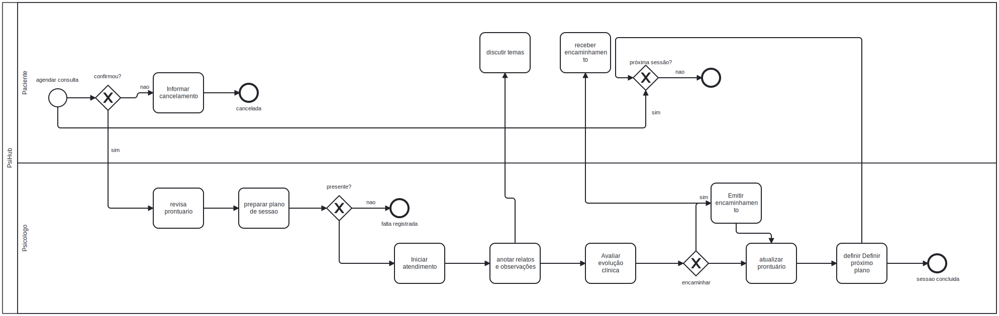

# 3.3.3 Processo 3 – Processo da Sessão

O Processo da Sessão contempla todas as etapas que envolvem a condução de uma consulta psicológica dentro do PsiHub, desde a preparação prévia do psicólogo até o encerramento e registro pós-sessão. Atualmente, esse fluxo é altamente fragmentado: anotações são feitas em papel ou arquivos desconexos, não há um espaço estruturado para registros antes ou depois da consulta, e o histórico clínico fica disperso, dificultando a visualização da evolução do paciente ao longo do tempo.

**Oportunidades de melhoria identificadas:**

- Centralizar as anotações clínicas pré, durante e pós-sessão em um prontuário eletrônico estruturado;
- Disponibilizar ao psicólogo, antes da sessão, um resumo da evolução emocional registrada pelo paciente entre as consultas;
- Permitir a vinculação de anotações à linha do tempo do paciente, criando um histórico clínico navegável;
- Reduzir o risco de perda de informações sensíveis ao eliminar o uso de papel e ferramentas genéricas.

---

## Detalhamento das atividades

### Preparação Pré-Sessão

| **Campo** | **Tipo** | **Restrições** | **Valor default** |
| --- | --- | --- | --- |
| Paciente selecionado | Seleção única | Deve ser um paciente com consulta agendada para o dia | — |
| Data da sessão | Data | Formato dd-mm-aaaa; não pode ser data futura | Data atual |
| Hora de início | Hora | Formato hh:mm:ss | Horário agendado |
| Resumo emocional do paciente (inter-sessões) | Área de texto | Gerado automaticamente a partir dos registros do paciente; somente leitura | — |
| Observações pré-sessão | Área de texto | Máximo de 2000 caracteres | — |
| Arquivos de referência | Arquivo | Formatos PDF, DOCX, JPG; máximo 10 MB por arquivo | — |

| **Comandos** | **Destino** | **Tipo** |
| --- | --- | --- |
| Iniciar sessão | Registro durante a sessão | default |
| Cancelar | Agenda do psicólogo | cancel |

---

### Registro Durante a Sessão

| **Campo** | **Tipo** | **Restrições** | **Valor default** |
| --- | --- | --- | --- |
| Anotações clínicas | Área de texto | Máximo de 5000 caracteres; campo obrigatório | — |
| Temas abordados | Seleção múltipla | Opções: Ansiedade, Depressão, Relacionamentos, Trabalho, Autoestima, Trauma, Outros | — |
| Nível de engajamento do paciente | Seleção única | Opções: Baixo, Médio, Alto | — |
| Intercorrências | Área de texto | Máximo de 1000 caracteres; preenchimento opcional | — |
| Hora de encerramento | Hora | Formato hh:mm:ss; deve ser posterior à hora de início | — |

| **Comandos** | **Destino** | **Tipo** |
| --- | --- | --- |
| Encerrar sessão | Registro pós-sessão | default |
| Salvar rascunho | Permanece na mesma atividade | — |

---

### Registro Pós-Sessão

| **Campo** | **Tipo** | **Restrições** | **Valor default** |
| --- | --- | --- | --- |
| Evolução clínica observada | Área de texto | Máximo de 3000 caracteres; campo obrigatório | — |
| Intervenções realizadas | Seleção múltipla | Opções: TCC, Psicanálise, ACT, Humanista, EMDR, Outras | — |
| Tarefas/encaminhamentos para o paciente | Área de texto | Máximo de 1000 caracteres | — |
| Data sugerida para próxima sessão | Data | Formato dd-mm-aaaa; deve ser data futura | — |
| Adicionar à linha do tempo | Seleção única | Opções: Sim / Não | Sim |
| Nível de progresso percebido | Número | Escala de 1 a 10 | — |

| **Comandos** | **Destino** | **Tipo** |
| --- | --- | --- |
| Salvar prontuário | Linha do tempo do paciente | default |
| Agendar próxima sessão | Processo 5 – Agendamento de Consultas | — |
| Cancelar | Agenda do psicólogo | cancel |

---

### Visualização da Linha do Tempo do Paciente

| **Campo** | **Tipo** | **Restrições** | **Valor default** |
| --- | --- | --- | --- |
| Histórico de sessões | Tabela | Colunas: Data, Temas abordados, Nível de progresso, Ações; somente leitura | — |
| Filtro por período | Data | Formato dd-mm-aaaa (data inicial e data final) | Últimos 30 dias |
| Filtro por tema | Seleção múltipla | Mesmas opções do campo "Temas abordados" | — |
| Gráfico de evolução emocional | Imagem | Gerado automaticamente a partir dos registros inter-sessões; somente leitura | — |
| Exportar relatório | Arquivo | Formato PDF; gerado pelo sistema | — |

| **Comandos** | **Destino** | **Tipo** |
| --- | --- | --- |
| Visualizar sessão específica | Detalhes do prontuário selecionado | default |
| Exportar relatório | Download do arquivo PDF | — |
| Voltar | Painel do psicólogo | cancel |
