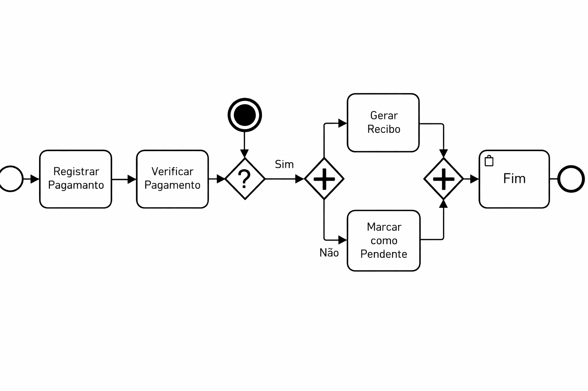

### 3.3.4 Processo 4 – Gestão Financeira

Apresenta-se o processo de gestão financeira, responsável por controlar os pagamentos das consultas realizadas. 
Como oportunidade de melhoria, busca-se automatizar o registro de pagamentos, reduzir erros manuais, evitar perdas financeiras e garantir maior controle sobre pagamentos pendentes e concluídos.

Em seguida, apresenta-se o modelo do processo descrito no padrão BPMN.

---

#### Detalhamento das atividades

As atividades do processo de gestão financeira são descritas a seguir, contendo seus respectivos campos, tipos de dados, restrições e comandos associados.

---

### **Registrar Pagamento**

Responsável por registrar os dados do pagamento realizado pelo paciente.

| Campo            | Tipo           | Restrições           | Valor default |
|------------------|---------------|---------------------|--------------|
| id_paciente      | Número        | obrigatório         | -            |
| valor            | Número        | maior que 0         | -            |
| forma_pagamento  | Seleção única | pix/cartão/dinheiro | -            |
| data_pagamento   | Data          | obrigatória         | -            |

| Comandos | Destino               | Tipo    |
|----------|----------------------|--------|
| salvar   | Verificar Pagamento  | default|
| cancelar | Fim do processo      | cancel |

---

### **Verificar Pagamento**

Responsável por verificar se o pagamento foi realizado corretamente.

| Campo            | Tipo           | Restrições       | Valor default |
|------------------|---------------|------------------|--------------|
| status_pagamento | Seleção única | pago/pendente    | pendente     |

| Comandos | Destino           | Tipo    |
|----------|------------------|--------|
| confirmar| Gerar Recibo     | default|
| pendente | Fim do processo  | cancel |

---

### **Gerar Recibo**

Responsável por gerar o comprovante de pagamento.

| Campo  | Tipo    | Restrições  | Valor default |
|--------|--------|------------|--------------|
| recibo | Arquivo| obrigatório | -            |

| Comandos  | Destino          | Tipo    |
|-----------|------------------|--------|
| finalizar | Fim do processo  | default|
