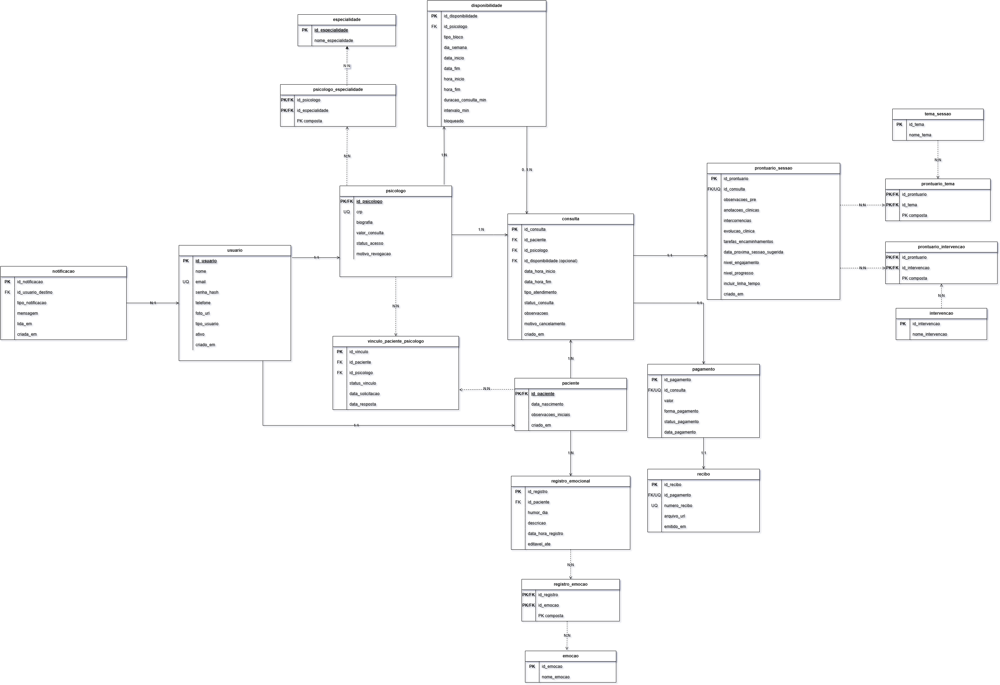

## 4. Projeto da solução

## 4.0 Detalhamento das atividades

Nesta seção são descritas as principais atividades do sistema PsiHub, responsáveis por atender às funcionalidades necessárias para o gerenciamento de uma clínica psicológica.

Os processos foram definidos com base nas necessidades do negócio e incluem cadastro de psicólogos, cadastro de pacientes, agendamento de consultas, registro de sessões e controle financeiro. Para cada processo foram identificadas suas tarefas, campos de dados e operações do sistema, que serão implementadas na aplicação web.

### 4.0.1 Gestão do Psicólogo

Responsável pelo gerenciamento dos profissionais cadastrados, permitindo manutenção e consulta dos dados.

**Tarefa**

- Cadastrar psicólogo
- Atualizar informações
- Consultar informações
- Remover cadastro

**Campos**

- id_psicologo (PK)
- nome
- cpf
- crp
- email
- telefone

**Comandos**

- Inserir psicólogo
- Atualizar psicólogo
- Buscar psicólogo
- Excluir psicólogo

### 4.0.2 Gestão do Paciente

Este processo permite o cadastro, atualização e consulta dos dados dos pacientes atendidos na plataforma.

**Tarefa**

- Cadastrar paciente
- Atualizar informações
- Consultar cadastro

**Campos**

- id_paciente (PK)
- nome
- cpf
- historico_clinico

**Comandos**

- Inserir paciente
- Atualizar paciente
- Buscar paciente

### 4.0.3 Processo da Sessão

Este processo registra as sessões realizadas, incluindo anotações clínicas e evolução do paciente.

**Tarefa**

- Registrar sessão
- Inserir anotações
- Finalizar sessão

**Campos**

- id_sessao (PK)
- data
- observacoes
- diagnostico
- id_paciente (FK)
- id_psicologo (FK)

**Comandos**

- Criar sessão
- Atualizar sessão
- Consultar sessão

### 4.0.4 Gestão Financeira

Este processo gerencia os pagamentos e o controle financeiro das consultas realizadas.

**Tarefa**

- Registrar pagamento
- Consultar pagamentos
- Emitir relatórios financeiros

**Campos**

- id_pagamento (PK)
- valor
- status
- id_consulta (FK)

**Comandos**

- Registrar
- Consultar
- Gerar relatório

### 4.0.5 Agendamento de Consultas

Este processo permite o gerenciamento das consultas, incluindo criação, remarcação e cancelamento.

**Tarefa**

- Criar agendamento
- Reagendar
- Cancelar consulta

**Campos**

- id_consulta(PK)
- data
- horario
- status
- id_paciente (FK)
- id_psicologo (FK)

**Comandos**

- Criar consulta
- Atualizar consulta
- Cancelar consulta

### 4.1. Modelo de dados

O modelo relacional do sistema PsiHub foi definido para cobrir os cinco processos de negocio: gestão de psicólogos, gestão de pacientes, agendamento de consultas, registro de sessões e controle financeiro.

A modelagem foi estruturada visando:

Rastreabilidade dos atendimentos clínicos
Controle consistente de agendamentos
Organização dos registros financeiros
Adequação aos princípios da Lei Geral de Proteção de Dados (LGPD)

As entidades foram relacionadas por meio de chaves primárias e estrangeiras, garantindo consistência e normalização dos dados.

### 4.2. Tecnologias

| **Dimensao**        | **Tecnologia**            | **Uso no projeto**                                               |
| ------------------- | ------------------------- | ---------------------------------------------------------------- |
| Linguagem Back-end  | Java 21                   | Implementacao da API e regras de negocio                         |
| Framework Back-end  | Spring Boot               | Estrutura principal da aplicacao server-side                     |
| Banco de Dados      | MySQL 8                   | Armazenamento relacional dos dados clinicos, agenda e financeiro |
| Front-end           | HTML5 + CSS3 + JavaScript | Interface para psicologo e paciente                              |
| Prototipacao/UI     | Figma                     | Definicao de fluxos e telas antes da implementacao               |
| Documentacao de API | OpenAPI (Swagger)         | Documentacao e validacao dos endpoints                           |
| Controle de versao  | Git + GitHub              | Versionamento, colaboracao e revisao de codigo                   |
| IDEs/Ferramentas    | VS Code, Postman          | Desenvolvimento e testes de API                                  |
