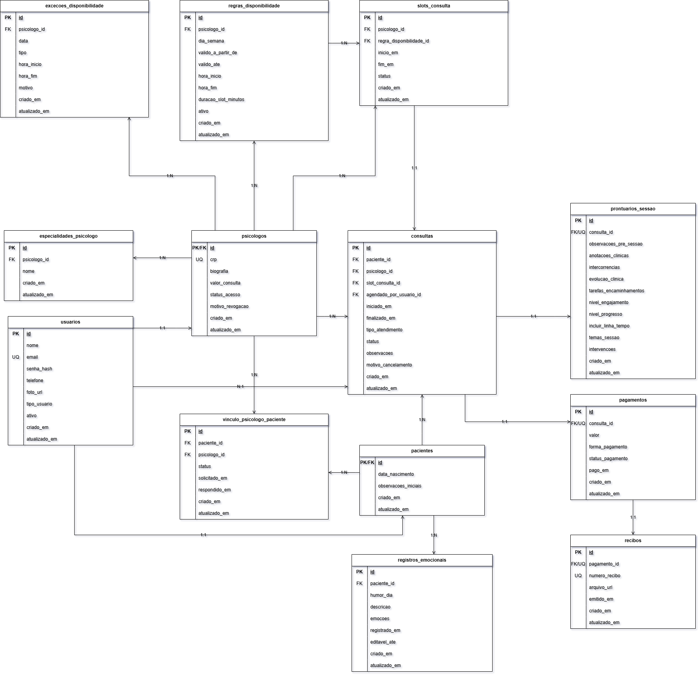

## 4. Projeto da solução

### 4.1. Modelo de dados

O modelo relacional do sistema PsiHub foi definido para cobrir os cinco processos de negocio: gestão de psicólogos, gestão de pacientes, agendamento de consultas, registro de sessões e controle financeiro.

A modelagem foi estruturada visando:

Rastreabilidade dos atendimentos clínicos
Controle consistente de agendamentos
Organização dos registros financeiros
Adequação aos princípios da Lei Geral de Proteção de Dados (LGPD)

As entidades foram relacionadas por meio de chaves primárias e estrangeiras, garantindo consistência e normalização dos dados.

### 4.2. Tecnologias

| **Dimensao**                  | **Tecnologia**            | **Uso no projeto**                                                       |
| ----------------------------- | ------------------------- | ------------------------------------------------------------------------ |
| Linguagem Back-end            | Java 21                   | Implementacao da API e regras de negocio                                 |
| Framework Back-end            | Spring Boot 3             | Estrutura principal da aplicacao server-side                             |
| Gerenciamento de dependencias | Maven Wrapper + Maven     | Build, execucao e organizacao das dependencias                           |
| Persistencia de dados         | Spring Data JPA/Hibernate | Mapeamento das entidades Java para o modelo relacional                   |
| Migracoes de banco            | Flyway                    | Versionamento e criacao automatizada do schema do banco de dados         |
| Banco de Dados                | MySQL 8                   | Armazenamento relacional dos dados clinicos, agenda e financeiro         |
| Ambiente local                | Docker Compose            | Subida do banco MySQL e do backend Java para desenvolvimento             |
| Containerizacao               | Dockerfile multi-stage    | Build do backend com JDK 21 e execucao em runtime Java 21                |
| Configuracao                  | Variaveis de ambiente     | Uso de DB_URL, DB_USERNAME, DB_PASSWORD e SERVER_PORT                    |
| Client de banco               | DataSource + MySqlClient  | Centralizacao da verificacao de disponibilidade e metadados do MySQL     |
| Validacao                     | Jakarta Bean Validation   | Base para validacao de entradas e regras de campos da API                |
| API REST                      | Spring Web                | Exposicao dos endpoints de agenda, consultas, sessao e prontuario        |
| Front-end                     | HTML5 + CSS3 + JavaScript | Interface para psicologo e paciente                                      |
| Prototipacao/UI               | Figma                     | Definicao de fluxos e telas antes da implementacao                       |
| Documentacao de API           | OpenAPI (Swagger)         | Documentacao e validacao dos endpoints                                   |
| Controle de versao            | Git + GitHub              | Versionamento, colaboracao e revisao de codigo                           |
| IDEs/Ferramentas              | VS Code, Postman          | Desenvolvimento e testes de API                                          |
